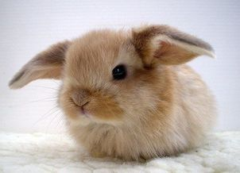

# Test Readme

With Fluffy Bunnies!

## The Happy Bunny - Poem by Christopher Howie



```
I am the happy bunny.
I hop, and when I hop, 
I laugh, and I squeak.
Squeak, Squeak, Squeak, I go! 
My little bunny nose
Squinches to and fro.
```

### Stanza 2


```
I am the happy bunny.
I hop, and when I hop, 
I am carefree, happy, and full of glee, 
When I go hopping on my little tree! 
Hop, Hop, Hop, I go! My little bunny legs
Leap to and fro.
```
### Stanza 3


```
I am the happy bunny.
I hop, and when I hop, 
I see my master, as he looks at my cage
He smiles, and laughs when I wiggle my ears! 
Wiggle, Wiggle, Wiggle, I go! My little bunny ears
Wriggle to and fro.
```

### Stanza 4
```
I love him, and he loves me, and he
Makes me the happiest bunny I could be. 
```

## Author

Christopher Howie