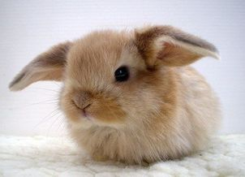
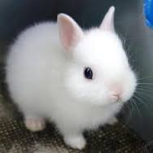

# Test Readme

With Fluffy Bunnies!

## The Happy Bunny - Poem by Robb Lovell

```
I am a happy bunny.
I hop high and low, 
I laugh, and I squeak and I
Squeak, Squeak, Go! 
My little bunny nose
Squinches to and fro.
```

{:width=300px}

### Stanza 2

```
I am the happy bunny.
I hop high and low,  
I am very happy, and full of glee, 
When I go hopping on my little tree! 
I Hop, Hop, Hop, and you see me go! 
My little bunny legs
Leap to and fro.
```


### Stanza 3


```
I am a happy bunny.
I hop high and low, 
I see my friends, as they look at my home
They smiles and they laugh when I wiggle my ears! 
Wiggle, Wiggle, Wiggle, I hear the show! 
My little bunny ears
Wriggle to and fro.
```




### Stanza 4
```
I love them, they love me, 
that makes me the most happy 
bunny I can be.
```

## Author

Robb Lovell

(modified from Christopher Howie)